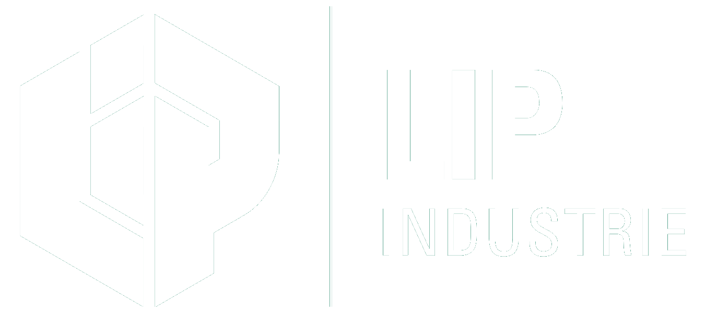

  

  ### La garantie d'une réponse précise

  **Usinage & mécanique de précision — Besançon, France**

  🟢 Retrouvez-nous à **Micronora 2026** · Hall B1 · Stand 503

  [🌐 lip-industrie.com](https://www.lip-industrie.com)

---

## Qui sommes-nous

Basée à Besançon, au cœur du bassin historique de la mécanique de précision,
**LIP Industrie Précision** conçoit et fabrique des pièces techniques de haute précision.
De la pièce unitaire à la petite série, nous mettons notre parc machine et notre savoir-faire
au service des projets les plus complexes — avec réactivité, rigueur et un contrôle qualité
sans compromis.

## Notre savoir-faire

- **Usinage numérique & traditionnel** — tournage CNC, fraisage 3 axes et 5 axes continu,
  tournage de haute précision sur Schaublin.
- **Électro-érosion & rectification** — électro-érosion à fil et par enfonçage, rectification
  plane, cylindrique et centerless, dépôt ESD carbure.
- **Contrôle & qualité** — mesure tridimensionnelle (MMT) et contrôle optique par caméra OGP,
  pour des tolérances au micron.

## Notre parc machine

| Moyens | Détail |
| --- | --- |
| Tournage | 3 tours CNC (Ø max. 300 mm) · 4 tours Schaublin 102 (Ø20) |
| 5 axes | 1 Integrex J200 5 axes (Ø300×1000) · 1 centre 5 axes continu (350×550×500) |
| Fraisage | 1 centre d'usinage CNC 3 axes (1100×510×510) |
| Électro-érosion | 2 machines à fil · 1 par enfonçage · 1 dépôt ESD carbure Rocklinizer |
| Rectification | 2 rectifieuses planes · 1 cylindrique · 1 centerless |
| Contrôle | 1 machine tridimensionnelle (MMT) · 1 contrôle par caméra OGP |

## Secteurs d'activité

**Aéronautique** · **Spatial & Défense** · **Médical & Horlogerie**

Des pièces critiques, dans des environnements qui n'autorisent aucune erreur.

## Nos engagements

⚡ **Réactivité** — une réponse rapide à vos demandes de chiffrage
⏱️ **Respect des délais** — des engagements tenus, planning après planning
🔧 **Flexibilité** — de la pièce unitaire à la série
🎯 **Qualité** — un contrôle rigoureux à chaque étape

## Nous contacter

- 📍 2D chemin de l'Ermitage, 25000 Besançon — France
- 📞 +33 (0)3 81 53 50 88
- ✉️ contact@lip-industrie.com
- 🌐 [www.lip-industrie.com](https://www.lip-industrie.com)

---

  © LIP Industrie Précision · Usinage de précision à Besançon, France

